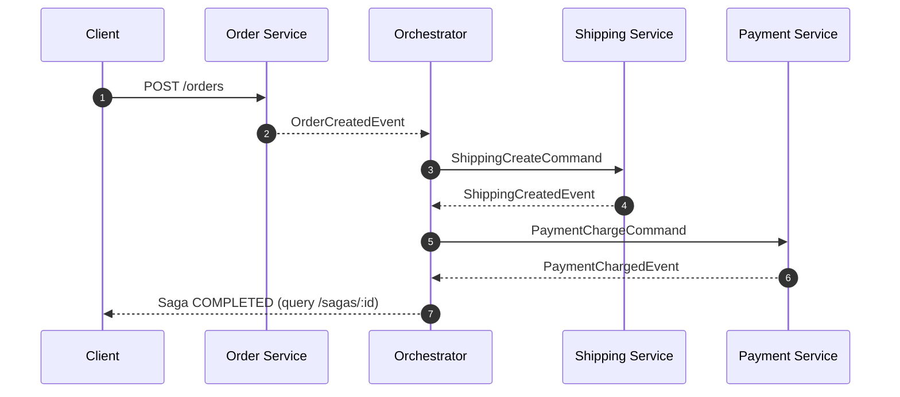
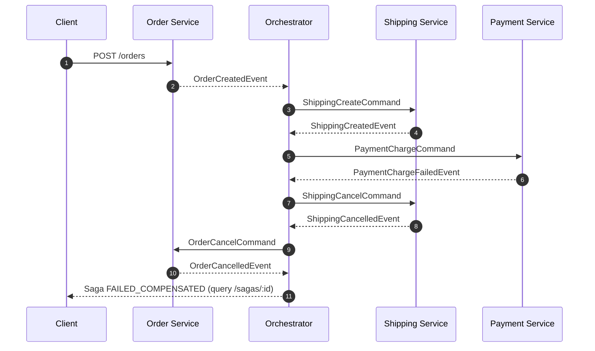

# Node.js Orchestrator Saga Example

A microservice saga example for order processing with async orchestration.

Flow:
1. Place order in `order-service`
2. `order-service` publishes `OrderCreatedEvent`
3. Orchestrator sends shipping command
4. Orchestrator sends payment command
5. On failure, orchestrator compensates in reverse order

## Stack
- Node.js + TypeScript (`ts-node`)
- RabbitMQ
- PostgreSQL (3 isolated databases)
- Docker Compose

## Services
- `orchestrator` (saga state machine + saga query API)
- `order-service` (order creation API + order DB)
- `shipping-service`
- `payment-service`

## Run
```bash
npm install
docker compose up --build
```

## Workspace Dependency Model
- This repo uses npm workspaces:
  - `libs/common` is the shared internal library package: `@app/common`
  - each service has its own `package.json` under `services/*`
- Root `npm install` / `npm ci` installs and links all workspaces.
- Docker images install dependencies per service workspace with `npm ci --workspace ...`.

## Endpoints
- `POST http://localhost:3001/orders`
- `GET http://localhost:3000/sagas/:sagaId`
- `POST http://localhost:3000/sagas/:sagaId/retry-compensation`

## Saga Flow Diagram
Success path:


Failure and compensation path:


## Example Requests
Happy path:
```bash
curl -X POST http://localhost:3001/orders \
  -H 'content-type: application/json' \
  -d '{
    "customerId":"cust-1",
    "items":[{"sku":"sku-1","qty":2,"price":20}],
    "shippingAddress":"123 Main St",
    "paymentMethodToken":"pm_card_visa"
  }'
```

Shipping failure:
```bash
curl -X POST http://localhost:3001/orders \
  -H 'content-type: application/json' \
  -d '{
    "customerId":"cust-2",
    "items":[{"sku":"sku-2","qty":1,"price":10}],
    "shippingAddress":"456 Main St",
    "paymentMethodToken":"pm_card_visa",
    "failAt":"shipping"
  }'
```

Payment failure:
```bash
curl -X POST http://localhost:3001/orders \
  -H 'content-type: application/json' \
  -d '{
    "customerId":"cust-3",
    "items":[{"sku":"sku-3","qty":1,"price":99}],
    "shippingAddress":"789 Main St",
    "paymentMethodToken":"pm_card_visa",
    "failAt":"payment"
  }'
```

Check saga status:
```bash
curl http://localhost:3000/sagas/<saga-id>
```

## Tests
Unit tests:
```bash
npm run test:unit
```

Integration tests (requires compose stack running):
```bash
npm run test:integration
```
